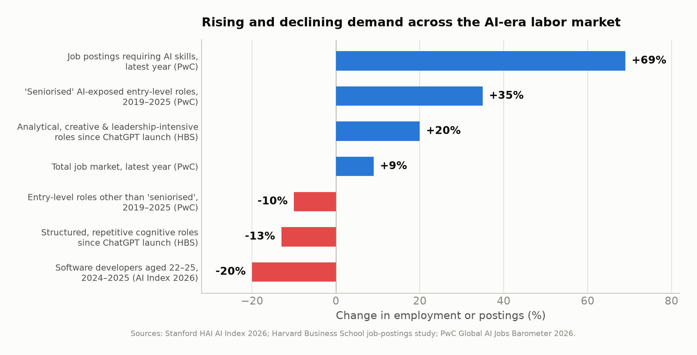
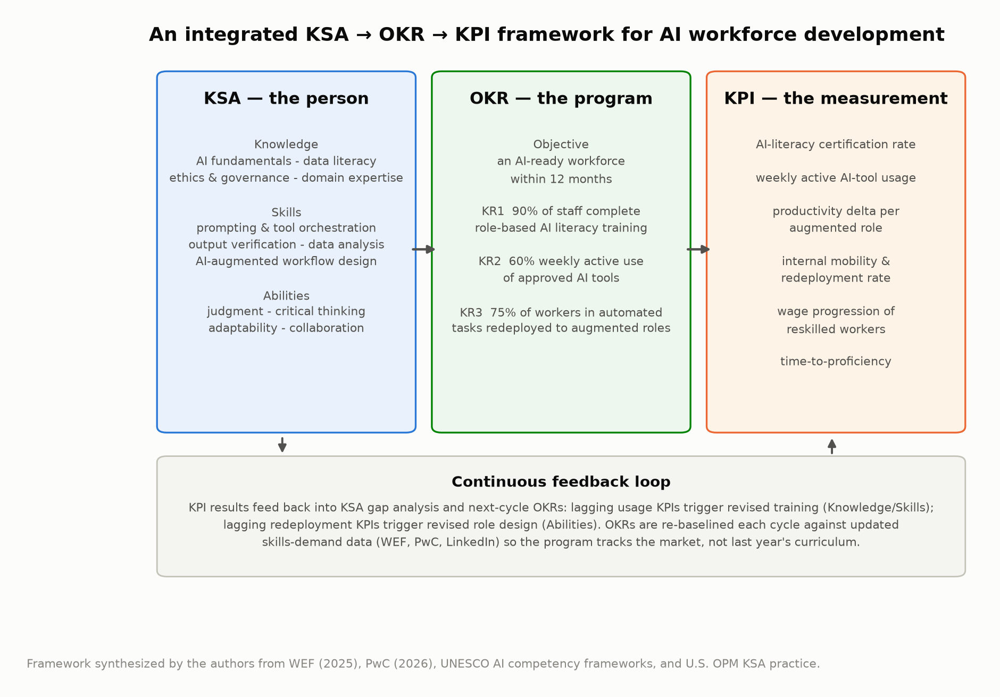

# The Impact of Artificial Intelligence on Society and the Economic Benefits for the Future Workforce: AI Literacy, Education, and a KSA–OKR–KPI Framework for AI-Job Readiness

**Ronnie Gladney**¹

¹ *AI Consultant* — Corresponding and first author (rongladney@gmail.com)

*July 2026 — Second (expanded) edition*

---

## Abstract

Artificial intelligence has moved from laboratory technology to general-purpose economic force in under a decade, and in the past eighteen months it has entered a capital-formation phase that is reshaping investment, labor markets, and public policy simultaneously. This paper synthesizes the most recent verifiable evidence — the Stanford AI Index (2025, 2026), the World Economic Forum's *Future of Jobs Report 2025*, PwC's Global AI Jobs Barometer (2025, 2026), the IMF's July 2026 *World Economic Outlook* update, LinkedIn's 2026 skills data, and peer-reviewed field experiments — to assess AI's societal impact and the economic benefits available to the future workforce. Five findings organize the analysis. (1) Global corporate AI investment more than doubled in 2025 to $581.7 billion, while organizational adoption approached ninety percent. (2) Macroeconomic projections place AI's contribution between $2.6 trillion annually and $15.7 trillion cumulatively by 2030, and AI-related investment added roughly half a percentage point to U.S. GDP growth in 2025. (3) The labor market is bifurcating rather than collapsing: 170 million new roles are projected against 92 million displaced by 2030, the wage premium for AI skills has climbed to 62%, and postings requiring AI skills are growing nearly eight times faster than the overall market — yet employment for the youngest workers in the most exposed occupations, such as software developers aged 22–25, fell almost 20% in a single year. (4) Skill value is repricing quickly: AI-engineering and human-judgment skills are rising together, while structured, repetitive cognitive work is declining. (5) Converting aggregate gains into broadly shared workforce benefits depends on AI literacy and education, and on managing workforce development with the same rigor applied to any strategic program. To that end, the paper contributes an integrated framework linking Knowledge, Skills, and Abilities (KSA) to Objectives and Key Results (OKR) and Key Performance Indicators (KPI) for AI workforce development. A 60-day trends analysis (May–July 2026) and recommendations for policymakers, employers, and workers conclude the paper.

**Keywords:** artificial intelligence, workforce development, AI literacy, labor economics, skills, KSA, OKR, KPI, education policy

---

## 1. Introduction

Between 2022 and 2025, enterprise adoption of AI rose faster than almost any enterprise technology on record; inference costs for comparable model performance fell roughly 280-fold in eighteen months; and AI performance on demanding software-engineering benchmarks leapt from 4.4% to 71.7% in a single year [1]. In 2025 the technology entered a second phase: a capital-formation cycle in which global corporate AI investment more than doubled to $581.7 billion [2], and in which the first clearly attributable labor-market effects — concentrated in entry-level hiring pipelines — became measurable [2, 25].

This pace has produced a familiar public anxiety: will AI eliminate more work than it creates? The empirical record suggests a more precise answer than either optimists or pessimists usually offer. AI is simultaneously *displacing* specific tasks, *augmenting* the productivity of workers who use it, *creating* new occupational categories, and *repricing* skills across the entire labor market. The direction of the net effect for any individual worker increasingly depends on one variable: whether that worker is AI-literate and AI-job-ready.

This second edition extends the original paper in three ways requested by practice. First, it adds a structured analysis of the most consequential economic, technological, and political developments of the last sixty days (Section 3), ranked by their likely impact on everyday life. Second, it adds a dedicated analysis of which skills are rising fastest and which are losing value, based on hiring data, wages, and technology trends (Section 7). Third, it operationalizes AI-job readiness through an integrated framework of Knowledge, Skills, and Abilities (KSA), Objectives and Key Results (OKR), and Key Performance Indicators (KPI) for workforce development (Section 9). Throughout, every quantitative claim is cited to a primary source and every figure is generated from the cited statistics.

## 2. Data and Method

This is a synthesis paper. Quantitative claims are drawn from primary institutional sources: the Stanford HAI *AI Index Report*, 2025 and 2026 editions [1, 2]; the World Economic Forum's *Future of Jobs Report 2025*, a survey of over 1,000 employers across 55 economies employing more than 14 million workers [3, 4]; PwC's *Global AI Jobs Barometer*, 2025 and 2026 editions, built on analysis of close to one billion job advertisements [5, 6]; macroeconomic projections from PwC [7], Goldman Sachs [8], and the McKinsey Global Institute [9]; the IMF's *World Economic Outlook Update* of July 8, 2026 [19]; LinkedIn's *Skills on the Rise 2026* [21] and associated Harvard Business School job-postings research [22]; controlled field studies published in *Science* and through the NBER [10, 11, 12]; and education-policy sources including the April 2025 U.S. executive order on AI education [13], U.S. Department of Labor guidance [14], NASBE [15], Gallup [16], UNESCO's AI competency frameworks [24], and the Microsoft–LinkedIn Work Trend Index [17]. Where estimates differ across institutions, the divergence is reported rather than averaged, and differing time bases are labeled explicitly. All figures were generated by the authors from the cited statistics; generation code accompanies the paper.

## 3. Recent Trends: The Sixty Days to Mid-July 2026

Three concurrent developments — one economic, one technological, one political — define the current moment. This section summarizes each and then ranks their likely impact on everyday life.

### 3.1 Economic: an energy shock colliding with an AI investment supercycle

The IMF's July 8, 2026 *World Economic Outlook Update* describes a global economy caught in "crosscurrents of war and technology" [19]. The escalating Middle East conflict has produced what the IMF characterizes as the largest energy supply shock on record, with oil prices surging roughly 32% and global inflation expectations for 2026 climbing to 4.7%; global growth has been trimmed to 3.0% for 2026, down from 3.5% in 2024–25 [19]. Pulling in the opposite direction is an unprecedented AI investment supercycle: AI-related investment added approximately half a percentage point to U.S. GDP growth in 2025, with spillovers to Asian technology-manufacturing hubs [19]; Bank of America now projects a $1.3 trillion global semiconductor market for 2026; and JP Morgan estimates more than $6 trillion in funding will be required through 2030 for AI data centers, energy projects, and the supply chain [19, 20]. The scale of this build-out has revived dot-com-era valuation concerns even among its financiers.

### 3.2 Technological: from chatbots to agents

The Stanford AI Index 2026 documents the technical inflection underlying the investment: AI agents — systems that execute multi-step tasks rather than answer single prompts — now perform reliably enough for enterprise deployment, while organizational readiness lags [2]. Generative AI captured nearly half of all private AI funding in 2025, growing more than 200% [2]. Notably, capability is no longer a U.S. monopoly: the AI Index reports the performance gap between leading U.S. and Chinese models has narrowed to low single digits on blind human-preference benchmarks, achieved at a fraction of U.S. private investment levels [2].

### 3.3 Political: the regulatory cliff of August 2026

The most consequential near-term political development is the EU AI Act reaching full applicability on **August 2, 2026**, when the high-risk regime — risk management, data governance, logging, transparency, human oversight, and post-market monitoring — becomes enforceable, with penalties up to €35 million or 7% of global revenue for prohibited practices [23]. In the sixty-day window, the European Commission published its Code of Practice on marking and labelling AI-generated content (June 10, 2026) and a cybersecurity-and-AI action plan (July 2026) [23]. The United States has moved the opposite direction — federal deregulation over a fragmented landscape of state rules — sharpening the compliance divergence multinationals face. Meanwhile, on July 13, 2026, more than 200 economists and AI researchers, including 16 Nobel laureates, published an open letter organized by Stanford's Digital Economy Lab warning that policymakers "must act now" to prepare for AI's economic impact [20].

### 3.4 Which developments will most affect everyday life

Ranked by breadth and immediacy of effect on ordinary households:

1. **The energy shock and inflation (immediate, universal).** Fuel, heating, and food-price pass-through from a 32% oil surge touches every household within months; it also raises the cost of the electricity-hungry AI build-out itself [19].
2. **Entry-level hiring contraction (immediate for young workers).** The ~20% one-year employment decline for software developers aged 22–25, and softness across AI-exposed entry-level roles, changes the first rung of the career ladder now, not in 2030 [2, 6].
3. **The EU AI Act and AI-content labelling (visible within a year).** Consumers will begin seeing systematic labels on AI-generated content and stronger recourse when automated systems make consequential decisions about credit, hiring, and services — a template likely to diffuse globally as compliance standardizes [23].
4. **Agentic AI in consumer services (rolling out through 2026–27).** As agents move into customer service, scheduling, banking, and government services, everyday interactions with institutions will increasingly be AI-mediated end to end [2].

## 4. AI's Impact on Society

### 4.1 Adoption has crossed the mainstream threshold

The share of organizations using AI in at least one business function rose from roughly 20% in 2017 to 50% by 2022, 55% in 2023, and 78% in 2024 — a 23-point jump in a single year — with adoption continuing to climb toward nine in ten organizations in 2025 surveys [1, 2, 18].

*Figure 1. Share of organizations using AI in at least one business function, 2017–2024. Source: McKinsey Global Survey on AI, as reported in the Stanford HAI AI Index Report 2025 [1, 18].*

### 4.2 Investment has entered a capital-formation phase

Global corporate AI investment reached **$581.7 billion in 2025, more than doubling** the $252.3 billion recorded in 2024; private investment grew 127.5% and generative AI captured nearly half of all private funding [1, 2]. Geographic concentration intensified: U.S. private AI investment reached **$285.9 billion — roughly 23 times China's tracked $12.4 billion** [2]. PwC projects China (a 26% GDP boost by 2030) and North America (14.5%) will together capture almost 70% of AI's global economic impact [7], raising distributional questions for economies that under-invest in both technology and skills.

*Figure 2. Global corporate AI investment (2024–2025) and private AI investment by geography (2025). Source: Stanford HAI AI Index Reports 2025 and 2026 [1, 2].*

### 4.3 Governance and trust are racing to catch up

U.S. federal agencies introduced 59 AI-related regulations in 2024 — more than double the 2023 count — and legislative mentions of AI rose 21.3% across 75 countries [1]. Two-thirds of countries now offer or plan K-12 computer-science education, twice as many as in 2019 [1]. Yet the gap between what AI systems can do and what publics and institutions are prepared to govern remains wide — the July 2026 economists' open letter [20] and the EU's August 2026 enforcement deadline [23] are both responses to that gap, and both argue for the literacy agenda developed in Section 8.

## 5. The Macroeconomic Evidence

### 5.1 Projected contribution to global output

Three widely cited institutional estimates frame the plausible range:

- **PwC:** AI adds **$15.7 trillion to global GDP by 2030** (~14% of global output), just over half from labor-productivity gains [7].
- **Goldman Sachs:** generative AI raises global GDP by **$7 trillion over a decade**, lifting annual productivity growth ~1.5 percentage points [8].
- **McKinsey Global Institute:** generative AI adds **$2.6–4.4 trillion annually** across 63 use cases — an economy the size of Germany every year [9].

*Figure 3. Institutional estimates of AI's economic impact in USD trillions; time bases differ and are labeled per bar. Sources: PwC [7]; Goldman Sachs [8]; McKinsey Global Institute [9].*

These estimates differ in scope and method, but they agree on the central point — and the IMF's attribution of ~0.5 percentage points of 2025 U.S. GDP growth to AI investment [19] shows the projections beginning to materialize in national accounts.

### 5.2 Productivity gains are measurable today

Controlled studies have measured AI's productivity effects directly:

- **Customer support:** in an NBER field study of 5,172 agents, a generative-AI assistant raised productivity **14% on average — and 34% for novice workers** — while leaving expert performance roughly unchanged [10]. AI compresses the experience gap, implying it can *reduce* skill-based inequality when deployed as an assistant.
- **Professional writing:** in a randomized experiment in *Science*, professionals using ChatGPT completed business-writing tasks **40% faster** with 18% higher rated quality [11].
- **Software engineering:** developers using GitHub Copilot completed a standardized task **55.8% faster** than controls [12].

*Figure 4. Measured productivity gains from generative-AI assistance in controlled studies. Sources: Brynjolfsson, Li & Raymond [10]; Noy & Zhang [11]; Peng et al. [12].*

At industry level, PwC finds productivity growth in the industries most exposed to AI nearly quadrupled after generative AI's arrival — from 7% cumulative (2018–2022) to 27% (2018–2024) — with three times higher growth in revenue per employee than the least-exposed industries [5].

## 6. Economic Benefits for the Future Workforce

### 6.1 Net job creation with massive churn

The WEF projects that by 2030, **170 million new roles will be created and 92 million displaced — a net increase of 78 million jobs**, with structural change affecting 22% of today's jobs [3, 4]. The fastest-growing roles include big-data specialists, AI/ML specialists, and software developers, alongside large absolute growth in care, education, agriculture, and delivery work.

*Figure 5. Projected global job creation and displacement by 2030. Source: WEF Future of Jobs Report 2025 [3, 4].*

The churn beneath the net figure is the policy challenge: 41% of employers plan reductions where AI automates tasks, but nearly half expect to *transition* staff into growing parts of the business [4]. Whether displacement resolves into transition or unemployment depends on retraining capacity.

### 6.2 The AI wage premium keeps climbing

PwC's Barometer documents a striking repricing of skills: the wage premium for jobs requiring AI skills rose from **25% (2024 report) to 56% (2025) to 62% (2026)**, ranging from 118% in consumer markets to 16% in government [5, 6]. Postings requiring AI skills grew **69% in the latest year against 9% for the total market** — nearly eight times faster [6]. Wages are growing about twice as fast in AI-exposed industries, and demand for formal degrees is falling fastest in AI-augmented jobs — a shift toward skills-based hiring [5, 6].

*Figure 6. The AI-skills wage premium across three Barometer editions, and productivity growth in AI-exposed industries. Source: PwC Global AI Jobs Barometer, 2025 and 2026 editions [5, 6].*

### 6.3 A two-track labor market — and pressure on the first rung

The 2026 Barometer describes a labor market splitting into two paths. Jobs "professionalised" by AI (where AI raises the skill and judgment content of work) are growing twice as fast as jobs "democratised" by AI, with 42% faster wage growth since 2021 [6]. AI-exposed entry-level roles that have been "seniorised" — now demanding judgment and leadership once expected of senior staff — grew 35% since 2019, while other entry-level roles declined 10% [6]. The AI Index 2026 quantifies the sharpest edge of this shift: **employment for software developers aged 22–25 fell nearly 20% from 2024**, one in three organizations expect AI-driven workforce reductions in the coming year, and anticipated cuts concentrate in service operations, supply chain, and software engineering — even as aggregate employment holds up [2]. The first rung of the career ladder is being redesigned in real time; Sections 8–9 address what workers and institutions can do about it.

## 7. Which Skills Are Rising, and Which Are Losing Value

### 7.1 The evidence from hiring data

Triangulating LinkedIn's 2026 hiring data [21], the Harvard Business School analysis of essentially all U.S. job postings 2019–2025 [22], PwC's billion-ad Barometer [6], and the WEF employer survey [3] yields a consistent picture:

**Rising fastest — two tracks accelerating together:**

1. **Applied AI-engineering skills:** prompt engineering, retrieval-augmented generation (RAG), model training and fine-tuning, vector databases, LangChain, OpenAI/Gemini API integration, data annotation, PyTorch [21].
2. **AI business and governance skills:** AI strategy, data governance, responsible AI, AI literacy itself — employers are hiring people who can deploy, manage, govern, and commercialize AI, not merely use it [21].
3. **Human-centered skills:** executive and stakeholder communication, leadership and people management, cross-functional collaboration [21]. PwC finds new tasks added to AI-exposed roles are **2.5 times more likely to rely on empathy, judgment, and creativity** — skills whose value rises as AI absorbs routine work [6] — and WEF's fastest-growing skill cluster pairs AI & big data (90% of employers expect rising demand) with analytical thinking, resilience, and technology literacy [3].

**Losing value:**

1. **Structured, repetitive cognitive work** — routine document processing, basic data entry and reporting, formulaic copywriting, boilerplate coding: postings for such roles declined **13%** after ChatGPT's launch, while analytical, creative, and leadership-intensive postings grew 20% [22].
2. **Generic entry-level task execution** — entry roles that have *not* been seniorised declined 10% since 2019 [6], and the youngest cohort in the most exposed occupation (software developers 22–25) saw employment fall ~20% in one year [2].
3. **Credential-only signals** — the share of AI-augmented jobs requiring a formal degree continues to fall, weakening the value of credentials unaccompanied by demonstrable skills [5, 6].

*Figure 7. Rising and declining demand across the AI-era labor market. Sources: Stanford HAI AI Index 2026 [2]; Harvard Business School job-postings analysis [22]; PwC Global AI Jobs Barometer 2026 [6].*

### 7.2 Which skills lead to higher pay and better job security

**Pay.** The premium attaches to *applied AI capability in a domain*: 62% on average, up to 118% in consumer markets [6]. Breadth compounds it — postings requiring four or more emerging digital skills pay up to 15% more in the UK and 8.5% more in the U.S. [5]. Workers in "professionalised" occupations have seen wage growth 42% faster since 2021 [6].

**Security.** The most defensible position combines both rising tracks: AI-tool fluency *plus* the judgment, communication, and domain expertise that AI cannot supply. Seniorised entry-level roles (+35%) versus other entry roles (−10%) is the clearest natural experiment [6]: security accrues to workers who move up the value chain from executing routine tasks to directing and verifying AI systems that execute them. Conversely, the least secure position is performing structured, repetitive cognitive work without AI leverage — the segment declining fastest across every dataset [2, 6, 22].

**Practical hierarchy for workers**, in descending order of labor-market return: (1) applied AI skills in your own domain; (2) judgment, verification, and communication skills that complement AI; (3) AI governance and responsible-AI capability; (4) broad multi-skill digital fluency; (5) credentials alone.

## 8. AI Literacy and Education: The Decisive Lever

### 8.1 What AI literacy means

Contemporary frameworks converge on four competencies: *functional* understanding of how AI systems produce outputs; *practical* skill in using AI tools effectively and safely; *critical* capacity to evaluate outputs for bias, error, and appropriate use; and *ethical* awareness of privacy, integrity, and societal implications. UNESCO's twin AI Competency Frameworks — for teachers (AI CFT) and students (AI CFS) — structure these into progressive levels (understand, apply, create) across human-centred mindset, ethics of AI, AI techniques and applications, and AI system design, and are now guiding national curricula [24]. The productivity literature gives the definition economic teeth: the largest measured gains accrue to workers who can *direct and verify* AI, and flow disproportionately to the less experienced [10] — making AI literacy a plausible equality-enhancing intervention, not merely an efficiency one.

### 8.2 Students are ahead of institutions

Roughly **four out of five U.S. high-school and college students now use AI for schoolwork**, while institutional policy remains uneven [2]. Globally, two-thirds of countries offer or plan K-12 computer-science education — double the 2019 share — and U.S. computing bachelor's degrees grew 22% over the decade [1].

*Figure 8. Selected AI literacy and skills-demand indicators. Sources: WEF [3, 4]; Microsoft & LinkedIn [17]; Stanford HAI [1, 2]; McKinsey [18].*

### 8.3 The policy response

- **Federal (U.S.).** The April 2025 executive order *Advancing Artificial Intelligence Education for American Youth* established a national AI-education task force, directed agencies to promote AI literacy from K-12 through postsecondary education, prioritized teacher training, and expanded AI-related registered apprenticeships [13]. Department of Labor guidance now encourages states to use WIOA funds for AI literacy among youth, adult, and dislocated-worker participants [14].
- **State.** By late 2025, **35 states plus Puerto Rico** had issued official AI guidance for schools; Ohio became the first state to require every K-12 district to adopt a formal AI-use policy by July 1, 2026 [15].
- **Educators.** Teacher capacity is the binding constraint, and the early evidence is encouraging: teachers using AI at least weekly save an average of **six hours per week** [16].
- **Employers.** 66% of leaders would not hire a candidate without AI skills; 71% would prefer a less-experienced candidate with AI skills over a more-experienced one without [17]. With 39% of existing skills expected to change by 2030 and skills gaps cited by 63% of employers as the top transformation barrier [3], employer-funded AI literacy is the cheapest arbitrage available: training internal staff costs far less than hiring external talent carrying a 62% premium [6].

## 9. AI-Job Readiness: A KSA → OKR → KPI Framework for Workforce Development

Sections 4–8 establish *why* AI readiness matters; this section operationalizes *how* to build and measure it. Three management instruments, used together, turn AI literacy from aspiration into managed capability: **Knowledge, Skills, and Abilities (KSA)** define what an AI-ready person possesses; **Objectives and Key Results (OKR)** define what the development program commits to achieve; **Key Performance Indicators (KPI)** define how progress is measured continuously. (OKR is sometimes expanded informally as "Objectives and Key Reports"; the canonical term, from Grove and Doerr, is Objectives and Key *Results* [26].) KSAs are the long-standing competency vocabulary of U.S. federal hiring practice [27], which makes this framing directly portable into public-sector workforce programs funded under WIOA [14].

*Figure 9. An integrated KSA → OKR → KPI framework for AI workforce development, with a continuous feedback loop. Synthesized by the authors from WEF [3], PwC [6], UNESCO [24], and U.S. OPM practice [27].*

### 9.1 Core KSAs for AI-job readiness

Each element below is anchored to the demand evidence of Section 7.

| Dimension | Core elements | Evidence anchor |
|---|---|---|
| **Knowledge** (what you must understand) | AI fundamentals and limitations; data literacy; AI ethics, governance, and regulation (incl. EU AI Act obligations); deep domain knowledge of one's own field | Governance skills rising [21]; EU high-risk regime enforceable Aug 2026 [23] |
| **Skills** (what you must be able to do) | Prompt formulation and AI-tool orchestration; output verification and evaluation; retrieval-augmented workflows; data analysis; AI-augmented process redesign | Fastest-growing technical skills on LinkedIn [21]; 62% wage premium [6] |
| **Abilities** (durable capacities) | Judgment and critical thinking; adaptability and continuous learning; communication and stakeholder management; collaboration across functions | New AI-era tasks 2.5× more reliant on empathy, judgment, creativity [6]; human-centered track rising [21] |

### 9.2 Sample OKRs for a workforce-development program

A 12-month organizational objective with three measurable key results:

- **Objective:** Build an AI-ready workforce that captures measurable productivity value within 12 months.
  - **KR1:** 90% of employees complete role-based AI-literacy training mapped to the KSA matrix.
  - **KR2:** 60% of employees are weekly active users of approved AI tools in their actual workflows.
  - **KR3:** 75% of workers in task areas being automated are redeployed into augmented roles rather than separated.

Public-sector and education variants substitute completion, placement, and wage-progression results (e.g., "80% of WIOA AI-literacy participants placed in employment within two quarters at wages ≥110% of prior wage").

### 9.3 KPIs for continuous measurement

| KPI | Definition | Directional target | Cadence |
|---|---|---|---|
| AI-literacy certification rate | % of workforce holding current role-based certification | ≥90% | Quarterly |
| Active-use rate | % of staff using approved AI tools weekly | ≥60% | Monthly |
| Productivity delta | Output per worker in augmented roles vs. pre-deployment baseline | +15–40% (per Section 5.2 benchmarks) | Quarterly |
| Redeployment rate | % of workers in automated task areas transitioned internally | ≥75% | Quarterly |
| Wage progression | Median wage growth of reskilled workers vs. non-participants | Positive gap | Annual |
| Time-to-proficiency | Weeks from training start to verified independent AI-augmented work | Declining | Per cohort |

### 9.4 The feedback loop

The three instruments only work as a closed loop: KPI results feed back into KSA gap analysis and next-cycle OKRs. Lagging active-use KPIs indicate a Knowledge/Skills gap (revise training); lagging redeployment KPIs indicate an Abilities/role-design gap (revise job architecture). Critically, the KSA matrix must be re-baselined against external skills-demand data (WEF, PwC, LinkedIn) each cycle — Section 7 shows skills in AI-exposed occupations changing more than twice as fast as elsewhere [6], so a static curriculum is obsolete within a planning cycle.

## 10. Recommendations

**For policymakers.** Treat AI literacy as foundational, on par with reading and numeracy, using UNESCO's frameworks as curricular scaffolding [24]. Fund teacher professional development first. Use existing workforce machinery (WIOA) with KSA-based eligibility and KPI-based accountability. Prepare specifically for the entry-level squeeze — subsidized apprenticeships and first-job pathways in AI-exposed occupations — because the youngest workers are absorbing the shock first [2, 6].

**For employers.** Adopt skills-based hiring; the degree signal is weakening fastest in transformed roles [5]. Run workforce development as a managed program with the Section 9 framework rather than as ad-hoc training. Target training toward less-experienced employees, where measured gains are largest [10]. Redesign — don't simply eliminate — entry-level roles: the seniorised-role evidence shows the alternative to cutting the first rung is raising it [6]. For any EU-touching deployment, treat August 2, 2026 compliance as a program deadline now [23].

**For workers and students.** Acquire demonstrable AI-tool fluency in your own domain first — that is where the 62% premium attaches [6]. Build the complements AI cannot supply: judgment, verification, communication, domain depth [6, 21]. Expect continuous reskilling: 39% of today's skills will change by 2030 [3]. If you are early-career, target seniorised roles deliberately — demonstrate judgment, ownership, and AI leverage rather than routine task throughput [2, 6].

## 11. Limitations

Macroeconomic projections diverge by nearly an order of magnitude across scope and method; they are scenario ranges, not forecasts. Survey-based employer projections reflect stated intentions, which historically overstate both hiring and displacement. The field-experimental productivity literature covers early-generation tools in a limited set of occupations. Sixty-day trend analysis (Section 3) relies partly on institutional flash estimates that may be revised. Most cited data over-represent large firms and advanced economies. The Section 9 framework is a synthesis of established management practice with current demand data, not itself a validated instrument; organizations should treat its targets as starting hypotheses to calibrate against their own KPI baselines. None of these caveats weakens the paper's central claim — that the private return to AI literacy is large, measurable, and rising — because that claim rests on observed labor-market prices and controlled experiments rather than projections.

## 12. Conclusion

The evidence assembled here describes an economy in which AI investment has entered a capital-formation phase ($581.7 billion in 2025, doubling year over year), adoption approaches ubiquity, and the macroeconomic upside plausibly reaches double-digit trillions by 2030 — with roughly half a point of U.S. GDP growth already attributable to AI investment. The labor market is not being hollowed out so much as split and repriced: 170 million roles created against 92 million displaced; a 62% and rising wage premium for AI skills; postings requiring those skills growing eight times faster than the market; and, at the same time, a real and measurable contraction at the entry level, where the youngest workers in the most exposed occupations have lost nearly a fifth of their employment in a year.

The technology's aggregate benefits are real; their distribution is not guaranteed. Distribution will be decided by AI literacy and education — from UNESCO-framework classrooms to WIOA-funded reskilling — and by whether organizations manage workforce development with the discipline they apply to any strategic program. The KSA → OKR → KPI framework offered here is a practical instrument for that discipline: define the competencies, commit to measurable results, measure continuously, and re-baseline against a skills market that is changing twice as fast as the one before it. The task for the remainder of the decade is not to predict the AI economy but to make ordinary workers ready for it.

---

## References

[1] Stanford Institute for Human-Centered Artificial Intelligence (HAI). *The 2025 AI Index Report*. Stanford University, April 2025. https://hai.stanford.edu/ai-index/2025-ai-index-report

[2] Stanford Institute for Human-Centered Artificial Intelligence (HAI). *The 2026 AI Index Report*. Stanford University, April 2026. https://hai.stanford.edu/ai-index/2026-ai-index-report

[3] World Economic Forum. *The Future of Jobs Report 2025*. Geneva: WEF, January 2025. https://reports.weforum.org/docs/WEF_Future_of_Jobs_Report_2025.pdf

[4] World Economic Forum. "Future of Jobs Report 2025: 78 Million New Job Opportunities by 2030 but Urgent Upskilling Needed to Prepare Workforces." Press release, January 2025. https://www.weforum.org/press/2025/01/future-of-jobs-report-2025-78-million-new-job-opportunities-by-2030-but-urgent-upskilling-needed-to-prepare-workforces/

[5] PwC. *The Fearless Future: 2025 Global AI Jobs Barometer*. June 2025. https://www.pwc.com/gx/en/news-room/press-releases/2025/ai-linked-to-a-fourfold-increase-in-productivity-growth.html

[6] PwC. *Two Futures for Jobs in an AI Era: 2026 Global AI Jobs Barometer*. 2026. https://www.pwc.com/gx/en/news-room/press-releases/2026/pwc-2026-ai-jobs-barometer.html

[7] PwC. *Sizing the Prize: What's the Real Value of AI for Your Business and How Can You Capitalise?* 2017. https://www.pwc.com/gx/en/issues/artificial-intelligence/publications/artificial-intelligence-study.html

[8] Goldman Sachs. "Generative AI Could Raise Global GDP by 7%." Goldman Sachs Research, April 2023. https://www.goldmansachs.com/insights/articles/generative-ai-could-raise-global-gdp-by-7-percent

[9] McKinsey Global Institute. *The Economic Potential of Generative AI: The Next Productivity Frontier*. June 2023. https://www.mckinsey.com/capabilities/mckinsey-digital/our-insights/the-economic-potential-of-generative-ai-the-next-productivity-frontier

[10] Brynjolfsson, E., Li, D., & Raymond, L. "Generative AI at Work." NBER Working Paper No. 31161, National Bureau of Economic Research, 2023. https://www.nber.org/papers/w31161

[11] Noy, S., & Zhang, W. "Experimental Evidence on the Productivity Effects of Generative Artificial Intelligence." *Science*, 381(6654), 187–192, 2023. https://www.science.org/doi/10.1126/science.adh2586

[12] Peng, S., Kalliamvakou, E., Cihon, P., & Demirer, M. "The Impact of AI on Developer Productivity: Evidence from GitHub Copilot." arXiv:2302.06590, 2023. https://arxiv.org/abs/2302.06590

[13] The White House. *Advancing Artificial Intelligence Education for American Youth*. Executive Order, April 2025. https://www.whitehouse.gov/presidential-actions/2025/04/advancing-artificial-intelligence-education-for-american-youth/

[14] U.S. Department of Labor. "US Department of Labor Promotes AI Literacy Across the American Workforce." News release, August 2025; and Training and Employment Notice No. 07-25, February 2026. https://www.dol.gov/newsroom/releases/osec/osec20250826

[15] National Association of State Boards of Education (NASBE). "States Take Next Steps on Governing AI Use in Schools." 2025. https://www.nasbe.org/states-take-next-steps-on-governing-ai-use-in-schools/

[16] Walton Family Foundation & Gallup. *The AI Dividend: New Survey Shows AI Is Helping Teachers Reclaim Valuable Time*. 2025. https://www.waltonfamilyfoundation.org/the-ai-dividend-new-survey-shows-ai-is-helping-teachers-reclaim-valuable-time

[17] Microsoft & LinkedIn. *2024 Work Trend Index Annual Report: AI at Work Is Here. Now Comes the Hard Part*. May 2024. https://www.microsoft.com/en-us/worklab/work-trend-index/ai-at-work-is-here-now-comes-the-hard-part

[18] McKinsey & Company. *The State of AI: How Organizations Are Rewiring to Capture Value*. Global Survey on AI, March 2025. https://www.mckinsey.com/capabilities/quantumblack/our-insights/the-state-of-ai

[19] International Monetary Fund. *World Economic Outlook Update, July 2026: Global Economy in Crosscurrents of War and Technology*. July 8, 2026. https://www.imf.org/en/publications/weo/issues/2026/07/08/world-economic-outlook-update-july-2026

[20] Al Jazeera. "Hundreds of Experts Warn the World Must Prepare Now for AI's Impact." July 13, 2026 (open letter organized by the Stanford Digital Economy Lab); see also Stanford Digital Economy Lab, *AI Economic Indicators: June 2026 Update*. https://www.aljazeera.com/economy/2026/7/13/hundreds-of-experts-warn-the-world-must-prepare-now-for-ais-impact ; https://digitaleconomy.stanford.edu/publication/ai-economic-indicators-june-2026-update/

[21] LinkedIn. *Skills on the Rise 2026: The Fastest-Growing Skills*. February 2026. https://news.linkedin.com/2026/Skills-on-the-rise-2026

[22] Harvard Business School job-postings analysis (2019–2025), as reported in Kaplan, S., "LinkedIn's 2026 Skills Report Reveals the Half of Your Resume AI Can't Touch," *Inc.*, 2026. https://www.inc.com/soren-kaplan/linkedins-2026-skills-report-reveals-the-half-of-your-resume-ai-cant-touch/91365799

[23] European Commission. "AI Act — Regulatory Framework for Artificial Intelligence" (full applicability August 2, 2026; Code of Practice on marking and labelling AI-generated content, June 10, 2026). https://digital-strategy.ec.europa.eu/en/policies/regulatory-framework-ai

[24] UNESCO. *AI Competency Framework for Teachers* and *AI Competency Framework for Students*. Paris: UNESCO, 2024. https://www.unesco.org/en/digital-education/ai-future-learning/competency-frameworks

[25] Forbes. "Stanford's AI Report Card: Agents Are Ready. Companies Are Not." April 14, 2026. https://www.forbes.com/sites/stevenwolfepereira/2026/04/14/stanfords-ai-report-card-agents-are-ready-companies-are-not/

[26] Doerr, J. *Measure What Matters: How Google, Bono, and the Gates Foundation Rock the World with OKRs*. Portfolio/Penguin, 2018.

[27] U.S. Office of Personnel Management. "Assessment & Selection: Competencies (Knowledge, Skills, and Abilities)." https://www.opm.gov/policy-data-oversight/assessment-and-selection/competencies/

---

*Figures 1–9 were produced by the authors from the statistics reported in the cited sources; generation code is available in `figures/make_figures.py` in the accompanying repository.*
