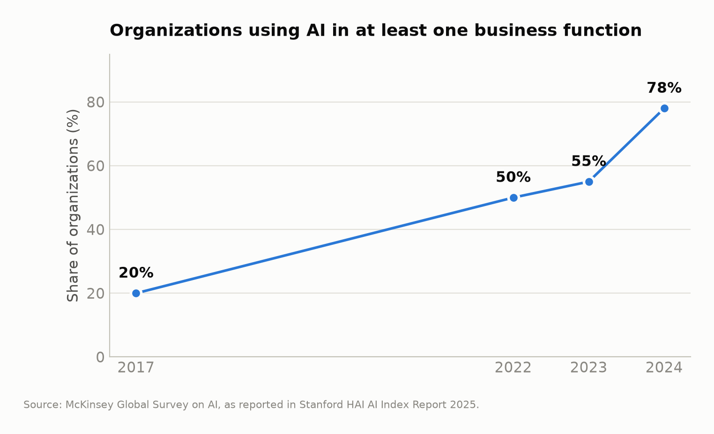
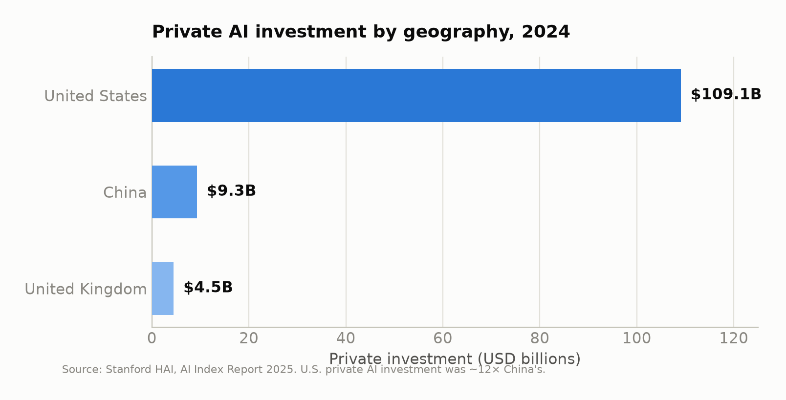
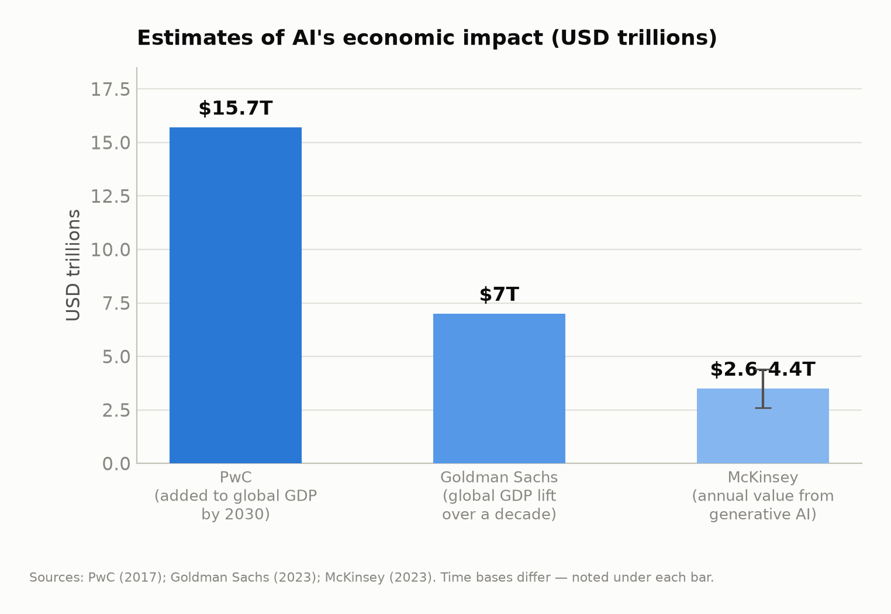
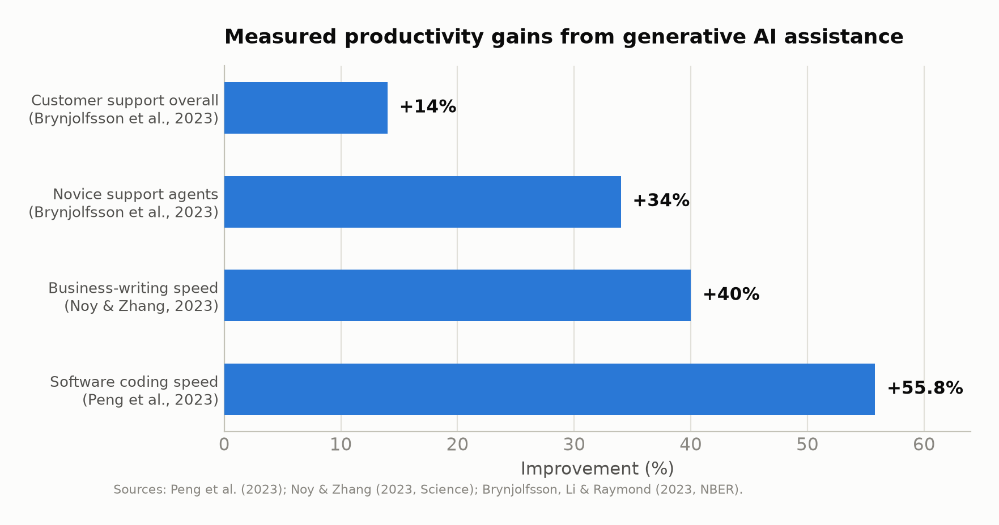
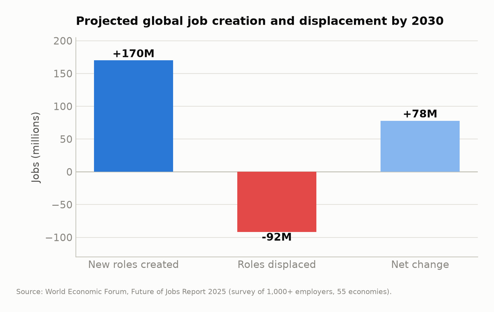
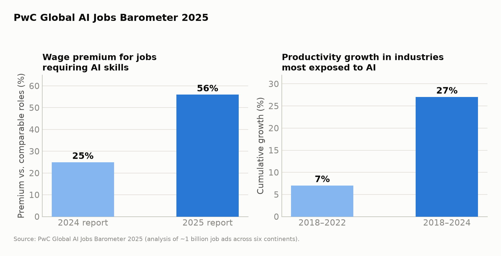
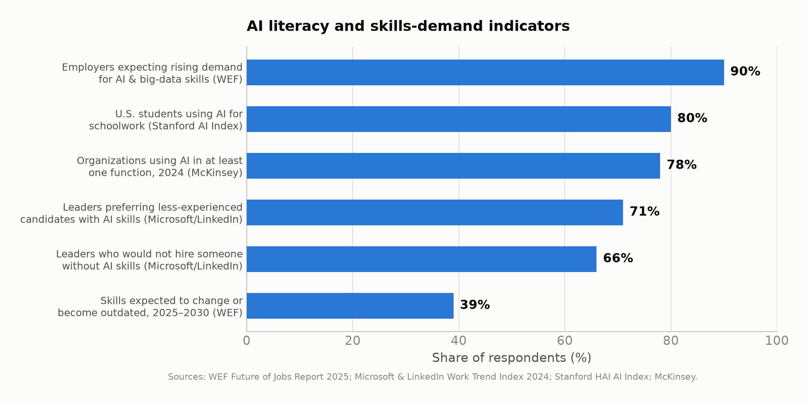

# The Impact of Artificial Intelligence on Society and the Economic Benefits for the Future Workforce: The Central Role of AI Literacy and Education

**Ronnie Gladney**¹

¹ *AI Consultant* — Corresponding and first author (rongladney@gmail.com)

*July 2026*

---

## Abstract

Artificial intelligence (AI) has moved from a laboratory technology to a general-purpose economic force in less than a decade. This paper synthesizes recent empirical evidence — drawn from the Stanford Institute for Human-Centered AI's AI Index, the World Economic Forum's Future of Jobs Report, PwC's Global AI Jobs Barometer, and peer-reviewed field experiments — to assess AI's impact on society and the economic benefits it offers the future workforce. The evidence indicates that (1) organizational adoption of AI has accelerated sharply, with 78% of organizations using AI in at least one business function by 2024, up from 55% a year earlier; (2) macroeconomic projections place AI's contribution to global output between $2.6 trillion annually and $15.7 trillion cumulatively by 2030; (3) labor markets are being restructured rather than simply automated, with a projected 170 million new roles created and 92 million displaced by 2030 — a net gain of 78 million jobs; and (4) workers with AI skills command a 56% wage premium, roughly double the premium observed one year earlier. We argue that these gains will not be evenly distributed unless AI literacy becomes a universal educational objective, and we review the rapid policy response — from the 2025 U.S. executive order on AI education to state-level K-12 frameworks — that is beginning to institutionalize AI literacy. The paper concludes with recommendations for educators, employers, and policymakers.

**Keywords:** artificial intelligence, workforce development, AI literacy, labor economics, productivity, education policy, skills gap

---

## 1. Introduction

Few technologies have diffused through the global economy as quickly as modern artificial intelligence. Between 2022 and 2024 — the period following the public release of large generative models — enterprise adoption of AI rose faster than almost any enterprise technology on record, inference costs for comparable model performance fell roughly 280-fold in eighteen months, and AI performance on demanding software-engineering benchmarks such as SWE-bench leapt from 4.4% to 71.7% in a single year [1].

This pace has produced a familiar public anxiety: will AI eliminate more work than it creates? The empirical record assembled over the last three years suggests a more nuanced answer. AI is simultaneously *displacing* specific tasks, *augmenting* the productivity of workers who use it, *creating* new occupational categories, and *repricing* skills across the labor market. The direction of the net effect for any individual worker increasingly depends on a single variable: whether that worker is AI-literate.

This paper makes three contributions. First, it consolidates the most credible recent statistics on AI adoption, investment, and macroeconomic impact into a single, cited narrative (Sections 3–4). Second, it examines the labor-market evidence — projections of job creation and displacement, measured productivity gains, and wage premia for AI skills (Section 5). Third, it argues that AI literacy and education constitute the decisive policy lever for converting aggregate economic gains into broadly shared workforce benefits, and it surveys the emerging institutional response (Section 6). Sections 7–9 offer recommendations, limitations, and conclusions.

## 2. Data and Method

This is a synthesis paper. Quantitative claims are drawn from primary institutional sources: the Stanford HAI *AI Index Report 2025* [1]; the World Economic Forum's *Future of Jobs Report 2025*, a survey of over 1,000 employers across 22 industry clusters and 55 economies representing more than 14 million workers [2, 3]; PwC's *Global AI Jobs Barometer 2025*, an analysis of close to one billion job advertisements from six continents [4]; macroeconomic projections from PwC [5], Goldman Sachs [6], and the McKinsey Global Institute [7]; and controlled field studies of generative-AI productivity effects published in *Science* and through the National Bureau of Economic Research [8, 9, 10]. Education and policy data are drawn from U.S. federal actions [11, 12], the National Association of State Boards of Education [13], Gallup [14], and the Microsoft–LinkedIn Work Trend Index [15]. All figures in this paper were generated by the authors from the cited statistics; the underlying values are reproduced in the text with their sources. Where estimates differ across institutions (notably GDP projections), the divergence is reported rather than averaged, and differing time bases are explicitly labeled.

## 3. AI's Impact on Society

### 3.1 Adoption has crossed the mainstream threshold

The clearest societal signal is adoption. According to McKinsey survey data reported in the AI Index, the share of organizations using AI in at least one business function rose from roughly 20% in 2017 to 50% by 2022, 55% in 2023, and 78% in 2024 — a 23-percentage-point jump in a single year, an adoption curve that typically takes enterprise technologies half a decade [1, 16]. Generative AI use in at least one function more than doubled over the same period.

*Figure 1. Share of organizations using AI in at least one business function, 2017–2024. Source: McKinsey Global Survey on AI, as reported in the Stanford HAI AI Index Report 2025 [1, 16].*

### 3.2 Investment is large and geographically concentrated

Global corporate AI investment reached **$252.3 billion in 2024**, up 26% year over year. Private investment is heavily concentrated: U.S. private AI investment reached **$109.1 billion** — nearly twelve times China's $9.3 billion and about twenty-four times the United Kingdom's $4.5 billion. Generative AI alone attracted $33.9 billion in global private investment, an 18.7% increase over 2023 [1].

*Figure 2. Private AI investment by geography, 2024. Source: Stanford HAI AI Index Report 2025 [1].*

This concentration matters for society because the geography of investment shapes the geography of benefit. PwC projects that China (a 26% GDP boost by 2030) and North America (14.5%) will together capture almost 70% — approximately $10.7 trillion — of AI's global economic impact [5], raising distributional questions for economies that under-invest in both technology and skills.

### 3.3 Governance and trust are racing to catch up

Society's regulatory response has accelerated in step with adoption. U.S. federal agencies introduced **59 AI-related regulations in 2024 — more than double** the 2023 count — and legislative mentions of AI rose 21.3% across 75 countries since 2023 [1]. In education specifically, two-thirds of countries now offer or plan to offer K-12 computer-science education, twice as many as in 2019 [1]. Yet institutional trust lags adoption: the AI Index characterizes 2024–2025 as a period in which "trust and regulation lag behind" record growth in capability and investment [1, 17]. This gap — between what AI systems can do and what publics and institutions are prepared to govern — is itself a societal impact, and an argument for the literacy agenda developed in Section 6.

## 4. The Macroeconomic Evidence

### 4.1 Projected contribution to global output

Three widely cited institutional estimates frame the plausible range of AI's macroeconomic contribution:

- **PwC** projects AI will add **$15.7 trillion to global GDP by 2030** — approximately 14% of global output — with just over half of the gain coming from labor-productivity improvements and the remainder from AI-driven consumer demand [5].
- **Goldman Sachs** estimates generative AI could raise global GDP by **$7 trillion over a decade**, lifting annual productivity growth by roughly 1.5 percentage points [6].
- **McKinsey Global Institute** estimates generative AI could add **$2.6–4.4 trillion annually** across 63 analyzed use cases — the equivalent of adding an economy the size of Germany to the world every year [7].

*Figure 3. Institutional estimates of AI's economic impact in USD trillions. Note that the time bases differ: PwC's figure is cumulative to 2030, Goldman Sachs's is a decade-long lift, and McKinsey's is an annual flow. Sources: PwC [5]; Goldman Sachs [6]; McKinsey Global Institute [7].*

The estimates are not directly comparable — they differ in scope (all AI vs. generative AI only), time base (annual flow vs. cumulative stock), and methodology — but they agree on the central point: the economic stakes are measured in trillions of dollars per year by the early 2030s.

### 4.2 Productivity gains are measurable today

Projections aside, controlled studies have now measured AI's productivity effects directly:

- **Customer support.** In a landmark NBER field study of 5,172 customer-support agents, access to a generative-AI assistant raised productivity (issues resolved per hour) by **14% on average — and 34% for novice and low-skilled workers** — while leaving expert performance roughly unchanged [8]. The finding that AI compresses the experience gap is among the most consequential results in the literature, because it implies AI can *reduce* skill-based inequality when deployed as an assistant.
- **Professional writing.** In a randomized experiment published in *Science*, mid-level professionals completing business-writing tasks with ChatGPT were **40% faster**, with output quality rated 18% higher [9].
- **Software engineering.** Developers using GitHub Copilot completed a standardized coding task **55.8% faster** than controls [10].

*Figure 4. Measured productivity gains from generative-AI assistance in controlled studies. Sources: Brynjolfsson, Li & Raymond [8]; Noy & Zhang [9]; Peng et al. [10].*

At the industry level, PwC's 2025 Jobs Barometer finds that since generative AI's proliferation in 2022, **productivity growth in the industries most exposed to AI has nearly quadrupled** — from 7% cumulative growth (2018–2022) to 27% (2018–2024) — and that AI-exposed industries now show three times higher growth in revenue per employee than the least-exposed industries [4].

## 5. Economic Benefits for the Future Workforce

### 5.1 Net job creation, not net destruction — but massive churn

The World Economic Forum's *Future of Jobs Report 2025* projects that by 2030, structural labor-market transformation will affect 22% of today's jobs: **170 million new roles will be created and 92 million displaced, for a net increase of 78 million jobs** [2, 3]. The fastest-growing roles include big-data specialists, AI and machine-learning specialists, and software developers, alongside large absolute growth in care work, education, agriculture, and delivery occupations.

*Figure 5. Projected global job creation and displacement by 2030. Source: World Economic Forum, Future of Jobs Report 2025 [2, 3].*

The churn beneath the net figure is the real policy challenge: 41% of employers plan to reduce workforce in roles where AI automates tasks, but nearly half expect to *transition* staff from AI-exposed roles into growing areas of the business [3]. Whether displacement resolves into transition or unemployment depends largely on retraining capacity — that is, on education.

### 5.2 AI skills now carry a large and rapidly growing wage premium

PwC's 2025 Global AI Jobs Barometer, built on nearly one billion job ads, documents a striking repricing of skills [4]:

- Jobs requiring AI skills pay a **56% wage premium** over comparable roles — up from 25% just one year earlier.
- Job postings requiring AI skills **grew 7.5%** year over year even as total postings fell 11.3%.
- Wages are rising **twice as fast** in industries most exposed to AI, in both automatable and augmentable roles.
- The skills employers seek are changing **66% faster** in AI-exposed occupations than elsewhere, and demand for formal degrees is falling fastest in AI-augmented jobs (from 66% to 59% requiring degrees), signaling a shift toward skills-based hiring.

*Figure 6. Wage premium for AI skills and productivity growth in AI-exposed industries. Source: PwC Global AI Jobs Barometer 2025 [4].*

### 5.3 The demand side: employers have already moved

Employer expectations reinforce the price signal. In the Microsoft–LinkedIn 2024 Work Trend Index, **66% of business leaders said they would not hire a candidate without AI skills, and 71% would prefer a less-experienced candidate with AI skills over a more-experienced candidate without them** [15]. The WEF finds that **90% of employers expect demand for AI and big-data skills to rise by 2030**, that 39% of workers' existing skill sets will be transformed or become outdated between 2025 and 2030, and that skills gaps are the single largest barrier to business transformation, cited by 63% of employers [2, 3]. For the future workforce, the implication is direct: AI literacy is becoming a threshold qualification — in many cases outranking years of experience.

## 6. AI Literacy and Education: The Decisive Lever

The evidence in Sections 4–5 describes an economy in which the returns to AI skills are large, rising, and increasingly decoupled from formal credentials. Whether those returns are broadly shared is an education question. This section reviews the state of AI literacy across K-12, higher education, and workforce training.

### 6.1 What AI literacy means

AI literacy is broader than programming. Contemporary frameworks converge on four competencies: (1) *functional* understanding of what AI systems are and how they produce outputs; (2) *practical* skill in using AI tools effectively and safely, including prompt formulation and output verification; (3) *critical* capacity to evaluate AI outputs for bias, error, and appropriate use; and (4) *ethical* awareness of privacy, academic integrity, and societal implications. The productivity literature gives this definition economic teeth: the largest measured gains accrue to workers who know how to *direct and verify* AI systems, and the NBER call-center evidence shows those gains flow disproportionately to less-experienced workers — making AI literacy a plausible equality-enhancing intervention, not merely an efficiency one [8].

### 6.2 Students are ahead of institutions

Adoption among learners has outpaced institutional readiness: Stanford's AI Index reports that roughly **four out of five U.S. high-school and college students now use AI for schoolwork**, even as institutional policy remains uneven [17]. Globally, two-thirds of countries now offer or plan K-12 computer-science education — double the 2019 share, with Africa and Latin America progressing fastest — and U.S. computing bachelor's degrees have grown 22% over the past decade [1].

*Figure 7. Selected AI literacy and skills-demand indicators. Sources: WEF [2, 3]; Microsoft & LinkedIn [15]; Stanford HAI [1, 17]; McKinsey [16].*

### 6.3 The policy response: from executive order to classroom

The United States moved decisively in 2025:

- **Federal.** In April 2025, the White House issued the executive order *Advancing Artificial Intelligence Education for American Youth*, establishing a national AI-education task force, directing federal agencies to promote AI literacy from K-12 through postsecondary education, prioritizing teacher training, and expanding registered apprenticeships in AI-related occupations [11]. In 2025–2026, the U.S. Department of Labor followed with guidance encouraging states to use Workforce Innovation and Opportunity Act (WIOA) funds to build AI literacy among youth, adult, and dislocated-worker program participants [12].
- **State.** By late 2025, **35 states plus Puerto Rico had issued official AI guidance for schools** focused on privacy, equity, and responsible use; several launched statewide frameworks and pilot programs. Ohio became the first state to require every K-12 district to adopt a formal AI-use policy by July 1, 2026, and Alaska's 2025 K-12 framework pairs AI instruction with ethics, digital literacy, and human-oversight requirements [13].
- **Educators.** Teacher capacity is the binding constraint — and early evidence is encouraging: Gallup finds that teachers who use AI tools at least weekly save an average of **six hours per week**, time that can be redirected to instruction [14].

### 6.4 Workforce upskilling: the employer's side of the bargain

Education systems cannot carry the transition alone; most of the 2030 workforce is already working. The WEF reports that 85% of employers plan to prioritize upskilling, and 63% identify skills gaps as their top transformation barrier [2, 3]. The economic logic of employer-funded AI training is unusually favorable: the measured productivity gains (Section 4.2) arrive within weeks of deployment; the largest gains accrue to the least-experienced staff [8]; and the alternative — competing for scarce external AI talent carrying a 56% wage premium [4] — is far more expensive than developing it internally. Firms that pair AI deployment with structured AI-literacy programs are, in effect, arbitraging the gap between the cost of training and the market price of AI skills.

## 7. Recommendations

**For policymakers.** (1) Treat AI literacy as foundational, on par with reading and numeracy, integrated across subjects rather than confined to computer-science electives. (2) Fund teacher professional development first — frameworks without trained teachers are unfunded mandates. (3) Use existing workforce-development machinery (e.g., WIOA in the U.S.) to reach adult and displaced workers, not only students. (4) Pair adoption incentives with governance guardrails to close the trust gap identified in Section 3.3.

**For employers.** (1) Adopt skills-based hiring — the degree signal is weakening fastest in exactly the roles being transformed. (2) Invest in internal AI-literacy programs before bidding for external talent at a 56% premium. (3) Target training toward less-experienced employees, where measured gains are largest. (4) Plan for *transition*, not termination: reallocating workers from automated tasks to augmented roles preserves institutional knowledge and reduces the social cost of transformation.

**For workers and students.** (1) Acquire demonstrable AI-tool fluency in your own domain — the premium attaches to applied skill, not certification alone. (2) Cultivate the complements AI cannot supply: judgment, verification, domain expertise, and interpersonal skill — the WEF's fastest-growing skill categories include analytical thinking, resilience, and technology literacy together [2]. (3) Expect to reskill continuously: 39% of today's skills will change by 2030 [2].

## 8. Limitations

Three caveats bound these conclusions. First, macroeconomic projections diverge by nearly an order of magnitude depending on scope and method; they should be read as scenario ranges, not forecasts. Second, survey-based employer projections (WEF) reflect stated intentions, which historically overstate both hiring and displacement. Third, the field-experimental productivity literature covers early-generation tools in a small set of occupations; effects may grow with model capability or shrink as tasks are redesigned. Fourth, most cited data over-represent large firms and advanced economies; the distributional picture in small enterprises and developing economies is thinner. None of these caveats, however, weakens the paper's central claim — that the private return to AI literacy is large, measurable, and rising — because that claim rests on observed labor-market prices and controlled experiments rather than projections.

## 9. Conclusion

The evidence assembled here supports a clear reading of AI's societal and economic trajectory. Adoption has crossed the mainstream threshold (78% of organizations), investment has passed a quarter-trillion dollars annually, and the macroeconomic upside plausibly reaches into the double-digit trillions by 2030. The labor market is not being hollowed out so much as violently reshuffled: 170 million roles created against 92 million displaced, with a 56% wage premium accruing to those equipped to work with AI and mounting evidence that AI assistance most benefits the least experienced. The technology's aggregate benefits are, on present evidence, real; their distribution is not guaranteed.

The distribution will be decided in classrooms, training programs, and hiring policies. AI literacy — functional, practical, critical, and ethical — is the mechanism by which an abstract trillion-dollar projection becomes a raise, a career change, or a first job. The policy scaffolding now emerging, from national executive orders to state K-12 frameworks to employer upskilling programs, is the right architecture. The task for the remainder of the decade is to fund it, staff it, and extend it to the workers and learners the market would otherwise leave behind.

---

## References

[1] Stanford Institute for Human-Centered Artificial Intelligence (HAI). *The 2025 AI Index Report*. Stanford University, April 2025. https://hai.stanford.edu/ai-index/2025-ai-index-report

[2] World Economic Forum. *The Future of Jobs Report 2025*. Geneva: WEF, January 2025. https://reports.weforum.org/docs/WEF_Future_of_Jobs_Report_2025.pdf

[3] World Economic Forum. "Future of Jobs Report 2025: 78 Million New Job Opportunities by 2030 but Urgent Upskilling Needed to Prepare Workforces." Press release, January 2025. https://www.weforum.org/press/2025/01/future-of-jobs-report-2025-78-million-new-job-opportunities-by-2030-but-urgent-upskilling-needed-to-prepare-workforces/

[4] PwC. *The Fearless Future: 2025 Global AI Jobs Barometer*. June 2025. https://www.pwc.com/gx/en/news-room/press-releases/2025/ai-linked-to-a-fourfold-increase-in-productivity-growth.html

[5] PwC. *Sizing the Prize: What's the Real Value of AI for Your Business and How Can You Capitalise?* 2017. https://www.pwc.com/gx/en/issues/artificial-intelligence/publications/artificial-intelligence-study.html

[6] Goldman Sachs. "Generative AI Could Raise Global GDP by 7%." Goldman Sachs Research, April 2023. https://www.goldmansachs.com/insights/articles/generative-ai-could-raise-global-gdp-by-7-percent

[7] McKinsey Global Institute. *The Economic Potential of Generative AI: The Next Productivity Frontier*. June 2023. https://www.mckinsey.com/capabilities/mckinsey-digital/our-insights/the-economic-potential-of-generative-ai-the-next-productivity-frontier

[8] Brynjolfsson, E., Li, D., & Raymond, L. "Generative AI at Work." NBER Working Paper No. 31161, National Bureau of Economic Research, 2023. https://www.nber.org/papers/w31161

[9] Noy, S., & Zhang, W. "Experimental Evidence on the Productivity Effects of Generative Artificial Intelligence." *Science*, 381(6654), 187–192, 2023. https://www.science.org/doi/10.1126/science.adh2586

[10] Peng, S., Kalliamvakou, E., Cihon, P., & Demirer, M. "The Impact of AI on Developer Productivity: Evidence from GitHub Copilot." arXiv:2302.06590, 2023. https://arxiv.org/abs/2302.06590

[11] The White House. *Advancing Artificial Intelligence Education for American Youth*. Executive Order, April 2025. https://www.whitehouse.gov/presidential-actions/2025/04/advancing-artificial-intelligence-education-for-american-youth/

[12] U.S. Department of Labor. "US Department of Labor Promotes AI Literacy Across the American Workforce." News release, August 2025; and Training and Employment Notice No. 07-25, February 2026. https://www.dol.gov/newsroom/releases/osec/osec20250826

[13] National Association of State Boards of Education (NASBE). "States Take Next Steps on Governing AI Use in Schools." 2025. https://www.nasbe.org/states-take-next-steps-on-governing-ai-use-in-schools/

[14] Walton Family Foundation & Gallup. *The AI Dividend: New Survey Shows AI Is Helping Teachers Reclaim Valuable Time*. 2025. https://www.waltonfamilyfoundation.org/the-ai-dividend-new-survey-shows-ai-is-helping-teachers-reclaim-valuable-time

[15] Microsoft & LinkedIn. *2024 Work Trend Index Annual Report: AI at Work Is Here. Now Comes the Hard Part*. May 2024. https://www.microsoft.com/en-us/worklab/work-trend-index/ai-at-work-is-here-now-comes-the-hard-part

[16] McKinsey & Company. *The State of AI: How Organizations Are Rewiring to Capture Value*. Global Survey on AI, March 2025. https://www.mckinsey.com/capabilities/quantumblack/our-insights/the-state-of-ai

[17] Stanford Institute for Human-Centered Artificial Intelligence (HAI). *The 2026 AI Index Report*. Stanford University, 2026. https://hai.stanford.edu/ai-index/2026-ai-index-report

---

*Figures 1–7 were produced by the authors from the statistics reported in the cited sources; generation code is available in `figures/make_figures.py` in the accompanying repository.*
